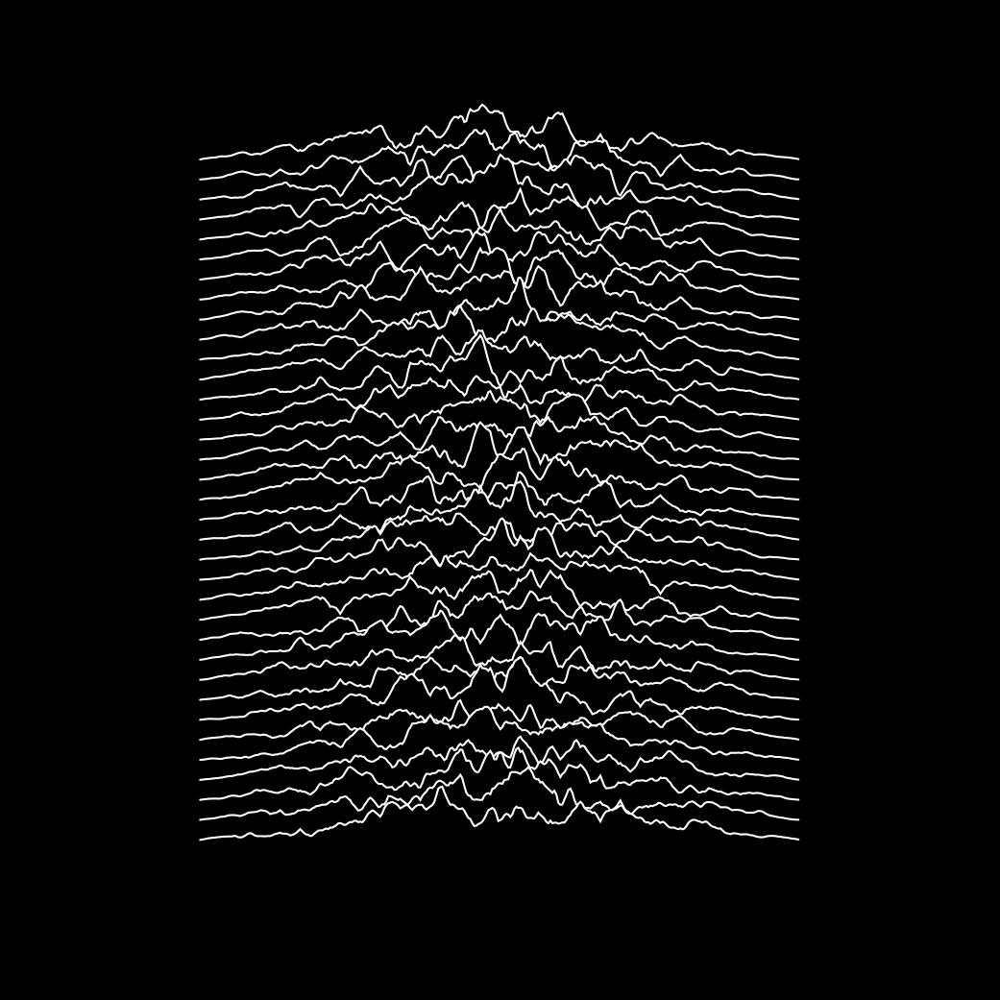

Album Examples
===============

Examples of albums recreated using Processing.

Joy Division — _Unknown Pleasures_
------------------------------------

Original:

Processing version:

This version randomizes the curves so that they will look different every time.

The Beatles — _White Album_
------------------------------------

Nirvana — _Nirvana_
------------------------------------