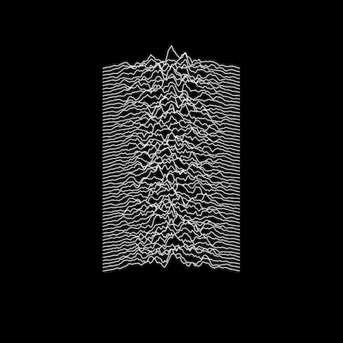

Album Examples
===============

Examples of albums recreated using Processing.

Joy Division — _Unknown Pleasures_
------------------------------------

Original:

Processing version:

This version randomizes the curves so that they will look different every time.

The Beatles — _White Album_
------------------------------------

Original:

Processing version:

This version is more of a "Rainbow Album" — each time it will be a different color. Additionally, the edition stamp in the bottom left will be a different random number every time.

Nirvana — _Nirvana_
------------------------------------

Original:

Processing version:

In this version I took the letters from the original title (N, I, R, V, A) and randomly form the title by combining them.

